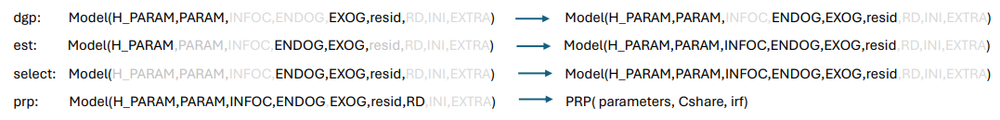

<!-- README.md is generated from README.Rmd. Please edit that file -->

```{r, include = FALSE}
knitr::opts_chunk$set(
  collapse = TRUE,
  comment = "#>",
  fig.path = "man/figures/README-",
  out.width = "100%"
)
```

# EMPBOOTSTRP

<!-- badges: start -->
<!-- badges: end -->

The goal of EMPBOOTSTRP is to ...

## Installation

You can install the development version of EMPBOOTSTRP from [GitHub](https://github.com/) with:

``` r
# install.packages("devtools")
devtools::install_github("puchen8229/EMPBOOTSTRP")
```
EMPBOOTSTRP is used to run bootstrap tests in an arbitrary statistical model. A statistical model is considered to be a list consisting of 9 components: the endogenous variable (ENDOG), the exogenous variable (EXOG), the model parameters (PARAM), the hypo-parameters (H_PARAM), the information criteria of the model (INFOC), the residuals of the model (resid), the initial values (INI), the forms of residual creation RD, and an extra component (EXTRA).

      Model = List (H_PARAM,PARAM,INFOC,ENDOG,EXOG,resid,RD,INI,EXTRA)

Often, some components of the model are unknown. The statistical task is to complete the model using the given known components. A data generating function (MODEL.DGP) maps a model with given H_PARAM, PARAM, EXOG, and resid to the model with ENDOG. An estimation function maps a model with ENDOG, EXOG, and H_PARAM to the model with PARAM. A model selection procedure maps a model with ENDOG and EXOG to the model with H_PARAM. For an estimated model, we are often interested in certain particular properties of the model, such as parameter constraints, stability, or impulse-response functions.   

```{r}

```
A bootstrap test of the properties PRP works as follows. For the $i$th bootstrap, $resid^{(i)}$, the functions dgp, est, and prp will generate the $i$th $PRP^{(i)}$. Then, the quantiles of $PRP^{(*)}$ can be used to test the estimated PRP. 

The following 5 examples demonstrate how EMPBOOTSTRP is used.

## Example 0

This example walks through a simple scenario. Its is meant to demonstrate the workflow. A bootstrap test of the population mean of a set of normal data is used in this simple scenario. 
$$ H_o: Co = 2  \hspace{1cm} H_a: Co \ne 2. \hspace{2cm}   H_o: Sigma = 1.5  \hspace{1cm} H_a: Sigma \ne 1.5$$ 


```{r example0, results='hide',fig.show='hide'}
library(EMPBOOTSTRP)


Data = rnorm(200)*1.2+1.9    #### this is pretended to be a set of real world data. 

#### set up a Model skeleton with an arbitrary PARAM

ENDOG = NA
n = 1
EXOG = NA
Co = 1
Sigma = as.matrix(1.0)
H_PARAM = list(n)
PARAM   = list(Co,Sigma);names(PARAM) = c("Co","Sigma")
resid   = NA
RD      = c("norm")
INI = NA
AIC = NA
BIC = NA
INFOC = list(AIC,BIC)
EXTRA = NA
Model = list(H_PARAM,PARAM,INFOC,ENDOG,EXOG,resid,RD,INI,EXTRA)
names(Model) = c("H_PARAM","PARAM","INFOC","ENDOG","EXOG","resid","RD","INI","EXTRA")


dgp = function(Model,T, M=1)
{
      Co    = Model$PARAM[[1]]
      Sigma = Model$PARAM[[2]]

      if ( Model$RD=="resid" )  {
		       resid = as.matrix(Model$resid)
      }
      if  ( Model$RD  == "norm" ) {
              resid = as.matrix(rnorm(T))%*%as.matrix(sqrt(Sigma))
      }
      Y = Co + resid
      Model$ENDOG   = as.matrix(Y)
      Model$resid   = as.matrix(resid)
	return(Model)
}

est = function(Model=DGP) {
## this is a program estimating VAR(p) with exogenous variables via LS
  n       = Model$H_PARAM[[1]]
  Y       = Model$ENDOG
  Co      = mean(Y)
  Sigma   = var(Y)
	T       = length(Model$ENDOG)
  PARAM   = list(Co,Sigma);   names(PARAM) = c("Co","Sigma")
  Model$PARAM = PARAM

  AIC =   2*2-2*(-(T*n/2)*log(2*pi) -(T*n/2) +(T/2)*log(det(solve(Sigma))))
  BIC =   log(T)*2- 2*(-(T*n/2)*log(2*pi) -(T*n/2) +(T/2)*log(det(solve(Sigma))))
  INFOC = list(AIC,BIC); names(INFOC) =c("AIC","BIC")
  Model$INFOC = INFOC
	return(Model)
}


Cshareo = c(0,0)*NA
PRP.PARAM = list(Cshareo); names(PRP.PARAM) = c("Cshareo")

prp = function(Model,PRP.PARAM)
{
     n = Model$H_PARAM[[1]]
      Co = Model$PARAM[[1]]
      Sigma = as.matrix(Model$PARAM[[2]])
      Cshare=c(Co[1]-2,Sigma[1,1]-1.5)
      results = list(Cshare)
      names(results) = c("Cshare")
      return(results)
}

DGP = MODEL.DGP(Model=Model,T=200,M=1)
EST <- MODEL.EST(Model=DGP)

Cshareo <- prp(EST,PRP.PARAM)
PRP.PARAM = list(Cshareo); names(PRP.PARAM) = c("Cshareo")

#######
PRP <- prp(EST,PRP.PARAM)


Method = "norm"
nrun   = 200
bootresult = MODEL.BOOT(EST,PRP,PRP.PARAM,nrun,Method)


SM<-Summary(OUT = bootresult,Model=EST,PRP.PARAM)


```


The following test result

            5%      95%       Co 
      1.829694 2.111876 1.980321 
            5%      95%    Sigma 
      1.392844 1.985147 1.674332 
            5%      95%       Cshare1 
      -0.17030606  0.11187628 -0.01967867 
            5%      95%       Cshare2 
      -0.1071562  0.4851468  0.1743317 

shows the bootstrapped confidence intervals for Co and Sigma (the first two lines), and the 5% and 95% quantile of the bootstrapped test statistics (the lase two lines). 

Using EMPBOOTSTRP to run a statistical test consists of the following steps:

      step 1: set up a Model skeleton with assigned H_PARAM, PARAM, resid (or RD) values.
      Step 2: Implementation of dgp, est, prp functions (select is optional.)
      Step 3: obtain an estimable Model skeleton DGP as the output of dgp(Model,T,M). For empirical application replace GDP$ENDOG by the empirical data.
      Step 4: obtain a complete Model skeleton EST as the output of est(Model=DGP).
      Step 5: obtain the test statistic values (Cshareo) by Cshareo = prp(Model=EST,PRP.PARAM)
      Step 4: run the bootstrap procedure MODEL.BOOT(Model=EST,PRP,)

## Example 1

This example demonstrates how to use EMPBOOTSTRP to run bootstrap tests on parameter restrictions and impulse-response functions in a VAR model. The R community offers a wide range of packages that can be used to generate data and estimate parameters for various types of models. In this case, we utilize the MRCIGVAR package for data generation and parameter estimation in a VAR model. We match the parameters in the VAR model to the given structure of 

      Model = List (H_PARAM, PARAM, INFOC, ENDOG, EXOG, resid, RD, INI, EXTRA). 

The variables n, p, and type represent three hypo-parameters, which correspond to the dimension of the variables, the lag length, and the types of the deterministic component, respectively. The VARData function from the MRCIGVAR package is used to generate data for a given n, p, T, and type. For an impulse response function, we need to specify the length (nstep) and the identification scheme. In this case, we utilize the generalized impulse response function. Regarding the parameter restriction:
$$H_0: B_{1,1}-B_{2,2}=0 \hspace{1cm} H_a: B_{1,1}-B_{2,2}\ne 0.$$
We save the value of the bootstrapped test statistic as Cshare, and the value of the statistic under the null is saved as Cshareo. Together with nstep=25 and irf = "gen", they are parameters of the prp function stored as PRP.PARAM.  


```{r example1, results='hide',fig.show='hide'}
library(EMPBOOTSTRP)
library(MRCIGVAR)

##### implementation of the three functions  dgp, est, prp

dgp = function(Model,T, M=2)
{
      n     = Model$H_PARAM[[1]]
      p     = Model$H_PARAM[[2]]
      type  = Model$H_PARAM[[3]]
      B     = Model$PARAM[[1]]
      Co    = Model$PARAM[[2]]
      Sigma = Model$PARAM[[3]]
      U     = Model$resid
      r_np  = NA
      A     = NA
      X     = Model$EXOG
      mu    = NA

      if ( Model$RD=="resid" )  {
		       resid = as.matrix(Model$resid)
      }
      if  ( Model$RD  == "norm" ) {
 	        if  (anyNA(Sigma))  { resid = matrix(rnorm(T*n),T,n) }
              else            { resid =  rnormSIGMA(T,Sigma)   }
      }

      ENDOG = as.matrix(resid)
      if ( !is.na(sum(Model$INI)) )   { ENDOG[1:p,] = as.matrix(Model$INI) }
      Yo = Model$INI
      res_d = VARData(n,p,T,r_np,A,B,Co,U,Sigma,type,X,mu,Yo)

     	H_PARAM = Model$H_PARAM
      PARAM   = list(res_d$B,res_d$Co,res_d$Sigma)
      INFOC   = Model$INFOC
      ENDOG   = res_d$Y
      EXOG    = res_d$X
      resid   = res_d$resid
      RD      = Model$RD
      INI     = Model$INI
      EXTRA   = res_d
      Model   = list(H_PARAM,PARAM,INFOC, ENDOG,EXOG,resid,RD,INI,EXTRA)
      names(Model) = c("H_PARAM","PARAM","INFOC", "ENDOG","EXOG","resid","RD","INI","EXTRA")
	return(Model)
}

est = function(Model) {
## this is a program estimating VAR(p) with exogenous variables via LS
  res_d   = Model$EXTRA
  res_e   = VARest(res_d)
	T       = dim(Model$ENDOG)[1]
	Model   = Model
	Sigma 	= res_e$Sigma
	resid		= res_e$resid
  B       = res_e$B
  Co      = res_e$Co
  Sigma   = res_e$Sigma
  PARAM   = list(B,Co,Sigma); names(PARAM) =c("B","Co","Sigma")
  AIC =   2*(n*n*p+n*(n+1)/2)-2*(-(T*n/2)*log(2*pi) -(T*n/2) +(T/2)*log(det(solve(Sigma))))
  BIC =   log(T)*(n*n*p+n*(n+1)/2)- 2*(-(T*n/2)*log(2*pi) -(T*n/2) +(T/2)*log(det(solve(Sigma))))
  INFOC = list(AIC,BIC)
  EXTRA = res_e
	Model = list(Model$H_PARAM,PARAM,INFOC,Model$ENDOG,Model$EXOG,resid,Model$RD,Model$INI,EXTRA)
	names(Model) = c("H_PARAM","PARAM","INFOC","ENDOG","EXOG","resid","RD","INI","EXTRA")
	return(Model)
}


# Model = EST
nstep = 25

irf = "gen"
Cshareo =c(0)
PRP.PARAM = list(nstep,irf,Cshareo); names(PRP.PARAM) = c("nstep","irf","Cshareo")

prp = function(Model,PRP.PARAM)
{
      B = Model$PARAM[[1]]
      p = Model$H_PARAM[[2]]
      n = Model$H_PARAM[[1]]
      BB = B; dim(BB) = c(n,n,p)
      Cshare=c(BB[1,1,1]-BB[2,2,1])
      irf = PRP.PARAM[[2]]
      nstep = PRP.PARAM[[1]]
      IRF   = matrix(0,n,n*nstep)
      dim(IRF) = c(n,n,nstep);
      dim(B) = c(n,n,p);
      resid = Model$resid
      sigma0 = t(resid)%*%resid/(nrow(resid)-ncol(resid)*p)
      IRF  <- irf_B_sigma(B,sigma0,nstep,irf=irf)
      results = list(Cshare,IRF)
      names(results) = c("Cshare","IRF")
      return(results)
}


ENDOG = NA
T = 400
n = 4
EXOG = NA
p = 1
B = matrix(0,n,n*p)
B = diag(c(0.8,0.8,0.8,0.7)); dim(B) = c(n,n,p)
Co = c(1:4)*0.5
type ="const"
H_PARAM = list(n,p,type)
Sigma   = NA
PARAM   = list(B,Co,Sigma)

resid   = NA
RD      = c("norm")
#INI     = ENDOG[1:p,]
INI = NA
AIC = NA
BIC = NA
INFOC = list(AIC,BIC)
EXTRA = NA
Model = list(H_PARAM,PARAM,INFOC,ENDOG,EXOG,resid,RD,INI,EXTRA)
names(Model) = c("H_PARAM","PARAM","INFOC","ENDOG","EXOG","resid","RD","INI","EXTRA")


#######
# dgp(Model=Model,T=200,M=4)

DGP = MODEL.DGP(Model=Model,T=200,M=4)
# Model = DGP
EST <- MODEL.EST(Model=DGP)


### obtain the test statistic under the null hypothesis.
Cshareo =  prp(EST,PRP.PARAM)$Cshare


PRP.PARAM = list(nstep,irf,Cshareo); names(PRP.PARAM) = c("nstep","irf","Cshareo")


Method = "norm"
nrun   = 200

bootresult = MODEL.BOOT(EST,PRP,PRP.PARAM,nrun,Method)

SM<-Summary(OUT = bootresult,Model=EST,PRP.PARAM)

IRF_list <-IRF_graph(SM[[3]])
IRF_list <-IRF_graph(SM[[4]])


```


## Example 2

In this example, we demonstrate bootstrapping in a cointegrated VAR model. We utilize the CIVARData and CIVARest functions from the MRCIGVAR package for the data generating process (DGP) and estimation function, respectively. In the prp function, we test a parameter restriction: $$H_0: B_{1,1,1}-B_{2,2,1}=0 \hspace{1cm} H_a: B_{1,1,1}-B_{2,2,1}\ne0 $$ 


```{r example2, results='hide',fig.show='hide'}

##### implementation of the three functions  dgp, est, prp


ENDOG = NA
EXOG  = NA
n     = 4
p     = 2
B     = c(1:(n*n*p))*NA; dim(B) = c(n,n,p)     
Co    = NA
Sigma = NA                       #Sigma = diag(c(1,2))
type  = "const"
crk   = 2
H_PARAM = list(n,p,type,crk)
alpha   = NA
beta    = NA

PARAM   = list(alpha,beta,B,Co,Sigma); names(PARAM) = c("alpha","beta","B","Co","Sigma")
AIC     = NA
BIC     = NA
INFOC   = list(AIC,BIC)
resid   = NA
RD      = c("norm")
INI     = NA					                         #INI     = ENDOG[1:p,]
EXTRA   = NA                                   #an extra element to for convenience
Model = list(H_PARAM,PARAM,INFOC, ENDOG,EXOG,resid,RD,INI,EXTRA)
names(Model) = c("H_PARAM","PARAM","INFOC","ENDOG","EXOG","resid","RD","INI","EXTRA")

T = 200

##### implementation of the three functions  dgp, est, prp

dgp = function(Model,T, M)
{
  n     = Model$H_PARAM[[1]]
  p     = Model$H_PARAM[[2]]
  type  = Model$H_PARAM[[3]]
  crk   = Model$H_PARAM[[4]]
  alpha = Model$PARAM[[1]]
  beta  = Model$PARAM[[2]]
  B     = Model$PARAM[[3]]
  Co    = Model$PARAM[[4]]
  Sigma = Model$PARAM[[5]]
  U     = Model$resid
  r_np  = NA
  A     = NA
  X     = Model$EXOG
  mu    = NA

  if ( Model$RD=="resid" )  {
    resid = as.matrix(Model$resid)
  }
  if  ( Model$RD  == "norm" ) {
    if  (anyNA(Sigma))  { resid = matrix(rnorm(T*n),T,n) }
    else            { resid =  rnormSIGMA(T,Sigma)   }
  }

  ENDOG = as.matrix(resid)
  if ( !is.na(sum(Model$INI)) )   { ENDOG[1:p,] = as.matrix(Model$INI) }
  Yo = Model$INI
  C1 = NA
  res_d = CIVARData(n,p,T,r_np,A,B,Co,C1,U,Sigma,type,X,mu,Yo,crk)

  H_PARAM = Model$H_PARAM
  alpha = NA
  beta  = NA
  PARAM   = list(alpha,beta,res_d$B,res_d$Co,res_d$Sigma); names(PARAM) = c("alpha", "beta" , "B","Co","Sigma")
  INFOC   = Model$INFOC
  ENDOG   = res_d$Y
  EXOG    = res_d$X
  resid   = res_d$resid
  RD      = Model$RD
  INI     = Model$INI
  EXTRA   = res_d
  Model   = list(H_PARAM,PARAM,INFOC, ENDOG,EXOG,resid,RD,INI,EXTRA)
  names(Model) = c("H_PARAM","PARAM","INFOC", "ENDOG","EXOG","resid","RD","INI","EXTRA")
  return(Model)
}


est = function(Model) {
  ## this is a program estimating VAR(p) with exogenous variables via LS
  res_d   = Model$EXTRA
  res_e   = CIVARest(res_d)
  T       = dim(Model$ENDOG)[1]
  Model   = Model
  Sigma 	= res_e$Sigma
  resid		= res_e$resid
  B       = res_e$B
  Co      = res_e$Co
  Sigma   = res_e$Sigma

  beta    = res_e$tst$beta
  crk     = Model$H_PARAM[[4]]
  alpha   = t(res_e$tst$estimation$coefficients[1:crk,])

  PARAM   = list(alpha,beta,B,Co,Sigma);names(PARAM) = c("alpha","beta","B","Co","Sigma")
  AIC     = 2     *(n*n*p+n*(n+1)/2-n*n-crk*crk+2*n*crk)- 2*(-(T*n/2)*log(2*pi) -(T*n/2) +(T/2)*log(det(solve(Sigma))))
  BIC     = log(T)*(n*n*p+n*(n+1)/2-n*n-crk*crk+2*n*crk)- 2*(-(T*n/2)*log(2*pi) -(T*n/2) +(T/2)*log(det(solve(Sigma))))
  INFOC   = list(AIC,BIC)
  EXTRA   = res_e
  Model   = list(Model$H_PARAM,PARAM,INFOC,Model$ENDOG,Model$EXOG,resid,Model$RD,Model$INI,EXTRA)
  names(Model) = c("H_PARAM","PARAM","INFOC","ENDOG","EXOG","resid","RD","INI","EXTRA")
  return(Model)
}

#MODEL.EST <- function(Model)
#{
#
#  estimate = est(Model)
#  Model$PARAM = estimate$PARAM
#  Model$resid = estimate$resid
#  Model$INFOC = estimate$INFOC
#  return(Model)
#}


### not run
#DGP = MODEL.DGP(Model,T=200,M=2)
#Model = DGP
#EST <- MODEL.EST(DGP)


### not run
nstep = 20
irf = "gen"
Cshareo = NA
PRP.PARAM = list(nstep,irf,Cshareo)
names(PRP.PARAM) = c("nstep","irf","Cshareo")

prp = function(Model,PRP.PARAM)
{
  B = Model$PARAM[[3]]
  p = Model$H_PARAM[[2]]
  n = Model$H_PARAM[[1]]
  Cshare=c(B[1,1,1]-B[2,2,1])
  irf = PRP.PARAM[[2]]
  nstep = PRP.PARAM[[1]]
  IRF   = matrix(0,n,n*nstep)
  dim(IRF) = c(n,n,nstep);
  dim(B) = c(n,n,p);
  resid = Model$resid
  sigma0 = t(resid)%*%resid/(nrow(resid)-ncol(resid)*p)
  IRF  <- irf_B_sigma(B,sigma0,nstep,irf=irf)
  results = list(Cshare,IRF)
  names(results) = c("Cshare","IRF")
  return(results)
}


### not run
#DGP = MODEL.DGP(Model,T=200,M=2)
#Model = DGP
#EST <- MODEL.EST(DGP)
#prp(EST,PRP.PARAM)

####### Application a typical procedure: Model construction selection estimation validation application
#######                                        MODEL.DGP    MODEL.SELECT, MODEL.EST, MODEL.BOOT, MODEL.PRP

ENDOG = NA
EXOG  = NA
n     = 4
p     = 2
B     = c(1:(n*n*p))*NA; dim(B) = c(n,n,p)     #B = c(0.5,0,0,0.4,0.2,0,0,0.2); dim(B) = c(n,n,p)
Co    = NA
Sigma = NA                                     #Sigma = diag(c(1,2))
type  = "const"
crk   = 2
H_PARAM = list(n,p,type,crk)
alpha   = NA
beta    = NA
PARAM   = list(alpha,beta,B,Co,Sigma); names(PARAM) = c("alpha","beta","B","Co","Sigma")
AIC     = NA
BIC     = NA
INFOC   = list(AIC,BIC)
resid   = NA
RD      = c("norm")
INI     = NA					                         #INI     = ENDOG[1:p,]
EXTRA   = NA                                   #an extra element to for convenience
Model = list(H_PARAM,PARAM,INFOC, ENDOG,EXOG,resid,RD,INI,EXTRA)
names(Model) = c("H_PARAM","PARAM","INFOC","ENDOG","EXOG","resid","RD","INI","EXTRA")


#######

DGP = MODEL.DGP(Model=Model,T=200,M=4)

plot(ts(DGP$ENDOG))
#Model = DGP
EST <- MODEL.EST(DGP)

Cshareo = prp(EST,PRP.PARAM)$Cshare
PRP.PARAM = list(nstep,irf,Cshareo); names(PRP.PARAM) = c("nstep","irf","Cshareo")


PRP = MODEL.PRP(EST,PRP.PARAM)


Method = "residuals"   ### correct Method = "norm"
nrun   = 200
#resid.BOOT = bstrp(Model=EST,nrun,Method,T=200)

bootresult = MODEL.BOOT(EST,PRP,PRP.PARAM,nrun,Method)


SM<-Summary(OUT = bootresult,Model=EST,PRP.PARAM)

IRF_list <-IRF_graph(SM[[3]])

```

## Example 3

In this example our dgp is a logit model $$y = \frac{1}{1+e^{-(Co+B_1X_1+B_2X_2)}}$$. We use the glm function in R for est, and in prp we want to test $$H_0: B_1^2-B_2 = 0 \hspace{1cm} H_1: B_1^2-B_2 \ne 0    $$ $$H_0: Co = 1 \hspace{1cm} H_1: Co \ne 0 $$ 


```{r example3, results='hide',fig.show='hide'}

##### set up a Model skeleton with given values for PARAM and H_PARAM.

T = 1000

ENDOG   = NA
EXOG    = matrix(rnorm(T*2),T,2)
n       = 1
Bo      = c(2,4)
Co      = c(1)
type    = "const"
H_PARAM = list(n,type); names(H_PARAM) = c("n","type")
PARAM   = list(Bo,Co); names(PARAM) = c("Bo","Co")
AIC     = NA
BIC     = NA
INFOC   = list(AIC,BIC)
resid   = NA
RD      = c("binomial")
INI     = NA					                         #INI     = ENDOG[1:p,]
EXTRA   = NA                                   #an extra element to for convenience
Model = list(H_PARAM,PARAM,INFOC, ENDOG,EXOG,resid,RD,INI,EXTRA)
names(Model) = c("H_PARAM","PARAM","INFOC","ENDOG","EXOG","resid","RD","INI","EXTRA")

Cshareo=c(Bo[1]^2-Bo[2],Co[1]-1)


##### implementation of the three functions  dgp, est, prp

dgp = function(Model,T, M)
{
  n     = Model$H_PARAM[[1]]
  type  = Model$H_PARAM[[2]]
  Bo    = Model$PARAM[[1]]
  Co    = Model$PARAM[[2]]
  resid = Model$resid
  X     = Model$EXOG
  z     = Co + X[,1]*Bo[1] + X[,2]*Bo[2]        # linear combination with a bias
  pr    = 1/(1+exp(-z))                         # pass through an inv-logit function
  YY    = rbinom(T,1,pr)                       # Bernoulli response variable
  if (anyNA(resid))   resid   = YY - z
  Y       = as.matrix(as.integer(z+resid))
  H_PARAM = Model$H_PARAM
  PARAM   = list(Bo,Co); names(PARAM) = c("Bo","Co")
  INFOC   = Model$INFOC
  ENDOG   = Y
  EXOG    = Model$EXOG
  RD      = Model$RD
  INI     = Model$INI
  EXTRA   = NA
  Model   = list(H_PARAM,PARAM,INFOC, ENDOG,EXOG,resid,RD,INI,EXTRA)
  names(Model) = c("H_PARAM","PARAM","INFOC", "ENDOG","EXOG","resid","RD","INI","EXTRA")
  return(Model)
}


est = function(Model) {
  ## this is a program estimating VAR(p) with exogenous variables via LS
  T       = dim(as.matrix(Model$ENDOG))[1]
  Y       = Model$ENDOG
  X       = Model$EXOG
  Model   = Model
  type    = Model$H_PARAM$type
  df      = data.frame(Y,X)
  if (type=="const") {
      Fit <- glm( Y~X,data=df,family="binomial")
      Co = Fit$coefficients[1]
      Bo = Fit$coefficients[-1]
  }
  if (type=="none") {
      Fit <- glm( Y~0+X,data=df,family="binomial")
      Co = 0
      Bo = Fit$coefficients
  }
  z     = Co + X%*%Bo
  resid = Y - z

  SM <- summary(Fit)
  AIC = SM$aic
  BIC = SM$aic+length(Fit$coefficients)*(log(T)-2)
  logLikel    = -(AIC-2*length(Fit$coefficients))/2

  PARAM   = list(Bo,Co)
  INFOC   = list(AIC,BIC)
  EXTRA   = NA
  Model   = list(Model$H_PARAM,PARAM,INFOC,Model$ENDOG,Model$EXOG,resid,Model$RD,Model$INI,EXTRA)
  names(Model) = c("H_PARAM","PARAM","INFOC","ENDOG","EXOG","resid","RD","INI","EXTRA")
  return(Model)
}


DGP = dgp(Model,T=1000, M=1)


#Model = DGP
EST <- MODEL.EST(Model=DGP)


### not run

Cshare = NA
PRP.PARAM = list(Cshare)


prp = function(Model,PRP.PARAM)
{
  Bo = Model$PARAM[[1]]
  Co = Model$PARAM[[2]]
  n = Model$H_PARAM[[1]]
  type = Model$H_PARAM[[2]]
  BB = Bo;
  Cshare=c(BB[1]^2-BB[2],Co[1]-1)

  results = list(Cshare)
  names(results) = c("Cshare")
  return(results)
}


Cshareo = prp(Model=EST,PRP.PARAM)
PRP.PARAM = list(Cshareo); names(PRP.PARAM) = c("Cshareo")


Method = "binomial"
nrun   = 200

bootresult = MODEL.BOOT(Model=EST,PRP,PRP.PARAM,nrun,Method="binomial")

SM<-Summary(OUT = bootresult,Model=EST,PRP.PARAM)


```


## Example 4

In this example we use a contributed R package MSwM to run a bootstrap test in a Markov Switching model: 
$$  y_t = \Big\{\begin{array}{c}
              c_o^{(1)}+b^{(0)}_1y_{t-1}+b^{(0)}_2x_{t} + u_{t}  \hspace{1cm}\mbox{ for } s_t=0\\
              c_o^{(2)}+b^{(1)}_1y_{t-1}+b^{(1)}_2x_{t} + u_{t}  \hspace{1cm}\mbox{ for } s_t=1
            \end{array}
  $$
where $s_t$ follow a Markov process. We use a function MSVARData for dgp, and in prp we test
$$H_0: {b^{(0)}_1}^2-b_1^{(1)} = 0 \hspace{1cm} H_1: {b^{(0)}_1}^2-b_1^{(1)} \ne 0   $$ $$ H_0: c_o^{(0)} - c_o^{(1)}=0 C\hspace{1cm} H_1: c_o^{(0)} - c_o^{(1)} \ne 0 $$ 


```{r example4, results='hide',fig.show='hide'}

##### set up a Model skeleton with given values for PARAM and H_PARAM.

library(MSwM)
library(markovchain)
############################################################################


### MSVARData is a function that generates MSVAR data. We use this function in the implementation of dgp

MSVARData=function(n,p,T,S,TM,Bo,Co,Sigmao,Uo,type,mu,X,St) {

  check = c(1:(S+1))*0
  if (missing(TM)) {
    TM = matrix(runif(S*S),S,S)
    TM = t(solve(diag(rowSums(TM)))%*%TM)
  }
  if (missing(Bo)&(p>0)) {

    Bo = (1:(n*n*p*S))*0
    dim(Bo) = c(n,n*p,S)
    for (i in 1:S) {
      VARD = VARData(n,p,T)
      Bo[,,i] = VARD$B
      check[i] = max(abs(VARD$Y))
    }
    dim(Bo) = c(n,n,p,S)
  } else {
    if (p==0) Bo = NA
  }
  if (missing(Sigmao))  Sigmao = NA

  if (anyNA(Sigmao)) {
    Sigmao = (1:(n*n*S))*0
    dim(Sigmao) = c(n,n,S)
    for (i in 1:S) {
      VARD = VARData(n,p=1,T)
      Sigmao[,,i] = VARD$Sigma
    }
  }

  if (missing(type)) {
    type = "none"
    Co = NA
  }
  if (missing(Uo)) Uo = NA

  if (anyNA(Uo)) {
    Uo = (1:(T*n*S))*0
    dim(Uo) = c(T,n,S)
    for (i in 1:S) Uo[,,i]= rnormSIGMA(T,as.matrix(Sigmao[,,i]))
  }
  Ct = Uo*0

  if (missing(X))  {
    X  = NA
  }

  if (type=="exog1")  {
    m = dim(X)[2]
    CC = rnorm(n*(m+1)*S)
    dim(CC) = c(n,m+1,S)
    if (missing(Co)) Co = CC

    if (n>1)   for (s in 1:S) Ct[,,s] = cbind(1,X)%*%t(Co[,,s])
    if (n==1)  for (s in 1:S) Ct[,,s] = cbind(1,X)%*% (Co[,,s])
  }

  if (type == "const") {
    if (missing(mu)) { mu = matrix(rnorm(n*S),n,S)}
    if (missing(Co)) {
      Co = mu
      for (s in 1:S) {

        if (p>0) for (L in 1:p) Co[,s] = Co[,s] - Bo[,,L,s]%*%mu[,s]
        #Ct[,,s] = matrix(1,T,1)%*%t(Co[,s])

      }
    }  else {
      mu = Co*NA
      for (s in 1:S) { H = diag(n) ; if
      (p>0) for (L in 1:p) H = H - Bo[,,L,s]
      mu[,s] = solve(H)%*%Co[,s]
      }
    }
    for (s in 1:S) Ct[,,s] = matrix(1,T,1)%*%t(Co[,s])
  }

  dtmcA <- new("markovchain",transitionMatrix=t(TM)) #   the TM notation in markovchain package is the transpose of HM

  if (missing(St)) St <- markovchainSequence(T, markovchain = dtmcA, t0 = "1")

  Y = as.matrix(Uo[,,1])
  for ( tt in (p+1):T )  {
    s = as.numeric(St[tt])
    Y[tt,] = Uo[tt,,s]+Ct[tt,,s]
    if (p>0) for (L in 1:p)    Y[tt,] = Y[tt,] + Y[tt-L,]%*%t(Bo[,,L,s])
  }

  check[S+1] = max(abs(Y))
  result=list(Y,X,Uo,Bo,Co,Sigmao,TM,St,type,check,n,p,S)
  names(result) = c("Y","X","Uo","Bo","Co","Sigmao","TM","St","type","check","n","p","S")
  return(result)
}


#### A Model skeleton with gien values in PARAM and H_PARAM and EXOG


TT = 300

ENDOG   = NA
EXOG    = matrix(rnorm(TT),TT,1)
n       = 1
p       = 1
PP      = c(0.7,0.8)
P       = matrix(c(0.7,0.3,0.2,0.8),2,2)
S       = 2
Co      = matrix(c(10,10,20,20),2,2);dim(Co) = c(1,2,2)
Bo      = matrix(c(-0.5,0.5),1,2); dim(Bo) = c(1,1,1,2)
Sigmao   = NA                       #Sigma = diag(c(1,2))
type    = "exog1"

H_PARAM = list(n,p,type,S)
PARAM   = list(Bo,Co,Sigmao,P); names(PARAM) = c("Bo","Co","Sigmao","P")
AIC     = NA
BIC     = NA
INFOC   = list(AIC,BIC)
resid   = NA
RD      = c("norm")
INI     = NA					                         #INI     = ENDOG[1:p,]
EXTRA   = NA                                   #an extra element to for convenience
Model = list(H_PARAM,PARAM,INFOC, ENDOG,EXOG,resid,RD,INI,EXTRA)
names(Model) = c("H_PARAM","PARAM","INFOC","ENDOG","EXOG","resid","RD","INI","EXTRA")


##### implementation of the three functions  dgp, est, prp

dgp = function(Model,TT, M)
{
  n     = Model$H_PARAM[[1]]
  p     = Model$H_PARAM[[2]]
  type  = Model$H_PARAM[[3]]
  S     = Model$H_PARAM[[4]]
  Bo    = Model$PARAM[[1]]
  Co    = Model$PARAM[[2]]
  Sigmao= Model$PARAM[[3]]
  P     = Model$PARAM[[4]]
  resid = Model$resid
  A     = NA
  X     = Model$EXOG

  if ( Model$RD=="resid" )  {
    resid = as.matrix(Model$resid)
  }

  res_d = MSVARData(n,p,TT,S,TM=P,Bo=Bo,Co=Co,Sigmao=Sigmao,Uo=resid,type=type,X=X)

  Bo      = res_d$Bo
  Co      = res_d$Co
  Sigmao  = res_d$Sigmao
  P       = res_d$TM
  resid   = res_d$Uo
  H_PARAM = Model$H_PARAM
  PARAM   = list(Bo,Co,Sigmao,P);
  INFOC   = Model$INFOC
  ENDOG   = res_d$Y
  EXOG    = Model$EXOG
  RD      = Model$RD
  INI     = Model$INI
  EXTRA   = NA
  Model   = list(H_PARAM,PARAM,INFOC, ENDOG,EXOG,resid,RD,INI,EXTRA)
  names(Model) = c("H_PARAM","PARAM","INFOC", "ENDOG","EXOG","resid","RD","INI","EXTRA")
  return(Model)
}

DGP = dgp(Model,TT=300, M=1)


Model = DGP

est = function(Model) {
  ## this is a program estimating VAR(p) with exogenous variables via LS
  T       = dim(Model$ENDOG)[1]
  Y       = Model$ENDOG
  X       = Model$EXOG
  Example = data.frame(X,Y)
  Model   = Model
  p       = Model$H_PARAM[[2]]
  mod     = lm(Y~X,data=Example)
  #plot(ts(Example))

  mod.mswm=msmFit(mod,k=2,p=1,sw=c(TRUE,TRUE,TRUE,TRUE),control=list(parallel=FALSE))

  Bo    = Model$PARAM[[1]]
  Co    = Model$PARAM[[2]]
  Sigmao= Model$PARAM[[3]]
  P     = Model$PARAM[[4]]
  resid = Model$resid

  #### identification of regime by the sign of

  if (mod.mswm@Coef[1,1] < mod.mswm@Coef[2,1]) {

    Bo[,,1,1:2] = mod.mswm@Coef[,3]
    Co[,,1]     = unlist(mod.mswm@Coef[1,-3])
    Co[,,2]     = unlist(mod.mswm@Coef[2,-3])
    Sigmao[,,1] = mod.mswm@std[1]
    Sigmao[,,2] = mod.mswm@std[2]
    P           = mod.mswm@transMat
    resid[(p+1):T,1,1:2] = mod.mswm@Fit@error
  }

  if (mod.mswm@Coef[1,1] > mod.mswm@Coef[2,1]) {

    Bo[,,1,2:1] = mod.mswm@Coef[,3]
    Co[,,2]     = unlist(mod.mswm@Coef[1,-3])
    Co[,,1]     = unlist(mod.mswm@Coef[2,-3])
    Sigmao[,,2] = mod.mswm@std[1]
    Sigmao[,,1] = mod.mswm@std[2]
    P[2:1,2:1]           = mod.mswm@transMat
    resid[(p+1):T,1,2:1] = mod.mswm@Fit@error
  }

  logLikel    = -mod.mswm@Fit@logLikel
  resid[(p+1):T,1,] = mod.mswm@Fit@error
  AIC      = (2*ncol(mod.mswm@Coef))*2 - 2*logLikel
  BIC      = (2*ncol(mod.mswm@Coef))*log(T-p) - 2*logLikel

  PARAM   = list(Bo,Co,Sigmao,P);names(PARAM) = c("Bo","Co","Sigma","P")
  INFOC   = list(AIC,BIC)
  EXTRA   = NA
  Model   = list(Model$H_PARAM,PARAM,INFOC,Model$ENDOG,Model$EXOG,resid,Model$RD,Model$INI,EXTRA)
  names(Model) = c("H_PARAM","PARAM","INFOC","ENDOG","EXOG","resid","RD","INI","EXTRA")
  return(Model)
}

Cshare = NA
PRP.PARAM = list(Cshare)

prp = function(Model,PRP.PARAM)
{
  Bo = Model$PARAM[[1]]
  Co = Model$PARAM[[2]]
  n = Model$H_PARAM[[1]]
  p = Model$H_PARAM[[2]]
  BB = Bo;
  Cshare=c(BB[1,1,1,1]-BB[1,1,1,2],Co[1,1,1]-Co[1,1,2])

  results = list(Cshare)
  names(results) = c("Cshare")
  return(results)
}


DGP = MODEL.DGP(Model=Model,T=300,M=1)
#Model = DGP
EST <- MODEL.EST(DGP)

Cshareo = prp(EST,PRP.PARAM)


PRP.PARAM = list(Cshareo); names(PRP.PARAM) = c("Cshareo")

PRP = MODEL.PRP(EST,PRP.PARAM)

Method = "norm"
nrun   = 200

bootresult = MODEL.BOOT(Model=EST,PRP,PRP.PARAM,nrun=200,Method="residuals")


SM<-Summary(OUT = bootresult,Model=EST,PRP.PARAM)


```

## Summary 

The examples above demonstrate that EMPBOOTSTRP can be used to run bootstrap for an arbitrary statistical model as long as we can embed the statistical model into the Model skeleton with 9 components, and code dgp, est, and prp functions that use the Model object as input and output. 

