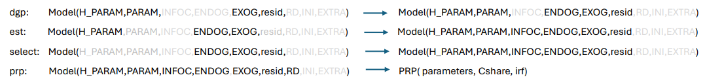
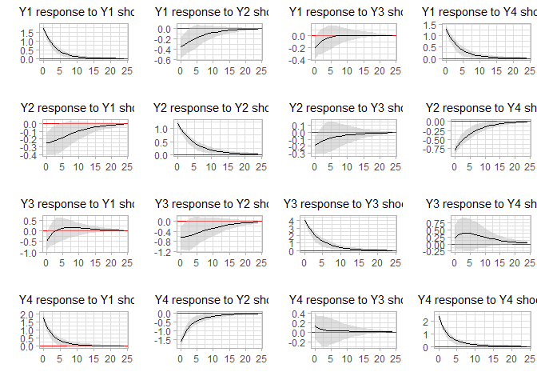
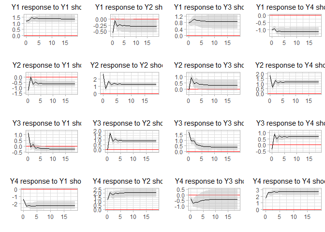

<!-- README.md is generated from README.Rmd. Please edit that file -->

# EMPBOOTSTRP

<!-- badges: start -->
<!-- badges: end -->

The goal of EMPBOOTSTRP is to …

## Installation

You can install the development version of EMPBOOTSTRP from
[GitHub](https://github.com/) with:

``` r
# install.packages("devtools")
devtools::install_github("puchen8229/EMPBOOTSTRP")
```

EMPBOOTSTRP is used to run bootstrap tests in an arbitrary statistical
model. A statistical model is considered to be a list consisting of 9
components: the endogenous variable (ENDOG), the exogenous variable
(EXOG), the model parameters (PARAM), the hypo-parameters (H_PARAM), the
information criteria of the model (INFOC), the residuals of the model
(resid), the initial values (INI), the forms of residual creation RD,
and an extra component (EXTRA).

      Model = List (H_PARAM,PARAM,INFOC,ENDOG,EXOG,resid,RD,INI,EXTRA)

Often, some components of the model are unknown. The statistical task is
to complete the model using the given known components. A data
generating function (MODEL.DGP) maps a model with given H_PARAM, PARAM,
EXOG, and resid to the model with ENDOG. An estimation function maps a
model with ENDOG, EXOG, and H_PARAM to the model with PARAM. A model
selection procedure maps a model with ENDOG and EXOG to the model with
H_PARAM. For an estimated model, we are often interested in certain
particular properties of the model, such as parameter constraints,
stability, or impulse-response functions.

``` r

```

 A bootstrap test of the
properties PRP works as follows. For the
th
bootstrap,
}"),
the functions dgp, est, and prp will generate the
th
}").
Then, the quantiles of
}")
can be used to test the estimated PRP.

The following 5 examples demonstrate how EMPBOOTSTRP is used.

## Example 0

This example walks through a simple scenario. Its is meant to
demonstrate the workflow. A bootstrap test of the population mean of a
set of normal data is used in this simple scenario.


    #> 
    #> Attaching package: 'EMPBOOTSTRP'
    #> The following object is masked from 'package:methods':
    #> 
    #>     Summary
    #>       5%      95%       Co 
    #> 1.025410 1.246133 1.139207 
    #>        5%       95%     Sigma 
    #> 0.9141204 1.2747132 1.0805961 
    #>         5%        95%    Cshare1 
    #> -0.9745900 -0.7538668 -0.8607930 
    #>         5%        95%    Cshare2 
    #> -0.5858796 -0.2252868 -0.4194039

The following test result

            5%      95%       Co 
      1.829694 2.111876 1.980321 
            5%      95%    Sigma 
      1.392844 1.985147 1.674332 
            5%      95%       Cshare1 
      -0.17030606  0.11187628 -0.01967867 
            5%      95%       Cshare2 
      -0.1071562  0.4851468  0.1743317 

shows the bootstrapped confidence intervals for Co and Sigma (the first
two lines), and the 5% and 95% quantile of the bootstrapped test
statistics (the lase two lines).

Using EMPBOOTSTRP to run a statistical test consists of the following
steps:

      step 1: set up a Model skeleton with assigned H_PARAM, PARAM, resid (or RD) values.
      Step 2: Implementation of dgp, est, prp functions (select is optional.)
      Step 3: obtain an estimable Model skeleton DGP as the output of dgp(Model,T,M). For empirical application replace GDP$ENDOG by the empirical data.
      Step 4: obtain a complete Model skeleton EST as the output of est(Model=DGP).
      Step 5: obtain the test statistic values (Cshareo) by Cshareo = prp(Model=EST,PRP.PARAM)
      Step 4: run the bootstrap procedure MODEL.BOOT(Model=EST,PRP,)

## Example 1

This example demonstrates how to use EMPBOOTSTRP to run bootstrap tests
on parameter restrictions and impulse-response functions in a VAR model.
The R community offers a wide range of packages that can be used to
generate data and estimate parameters for various types of models. In
this case, we utilize the MRCIGVAR package for data generation and
parameter estimation in a VAR model. We match the parameters in the VAR
model to the given structure of

      Model = List (H_PARAM, PARAM, INFOC, ENDOG, EXOG, resid, RD, INI, EXTRA). 

The variables n, p, and type represent three hypo-parameters, which
correspond to the dimension of the variables, the lag length, and the
types of the deterministic component, respectively. The VARData function
from the MRCIGVAR package is used to generate data for a given n, p, T,
and type. For an impulse response function, we need to specify the
length (nstep) and the identification scheme. In this case, we utilize
the generalized impulse response function. Regarding the parameter
restriction:


We save the value of the bootstrapped test statistic as Cshare, and the
value of the statistic under the null is saved as Cshareo. Together with
nstep=25 and irf = “gen”, they are parameters of the prp function stored
as PRP.PARAM.

    #> 
    #> Attaching package: 'MRCIGVAR'
    #> The following object is masked from 'package:EMPBOOTSTRP':
    #> 
    #>     rnormSIGMA
    #>        5%       95%        B1 
    #> 0.7430947 1.1471535 0.9654235 
    #>          5%         95%          B2 
    #> -0.34953053  0.01230942 -0.16843708 
    #>         5%        95%         B3 
    #> -0.4041992  0.1301326 -0.1317298 
    #>          5%         95%          B4 
    #> -0.25368475  0.12595580 -0.06882476 
    #>          5%         95%          B5 
    #> -0.09104374  0.12508939  0.02278788 
    #>        5%       95%        B6 
    #> 0.5724811 0.7726370 0.6929769 
    #>          5%         95%          B7 
    #> -0.07662586  0.18819416  0.04452551 
    #>           5%          95%           B8 
    #> -0.184072806  0.003376805 -0.082865994 
    #>          5%         95%          B9 
    #> -0.07403882  0.21580210  0.04787154 
    #>          5%         95%         B10 
    #> -0.13655162  0.13751811 -0.01294483 
    #>        5%       95%       B11 
    #> 0.4862774 0.8708559 0.7185744 
    #>          5%         95%         B12 
    #> -0.08465464  0.17682576  0.05511280 
    #>         5%        95%        B13 
    #> 0.01776906 0.36312992 0.19776507 
    #>          5%         95%         B14 
    #> -0.29859863  0.05655937 -0.09165609 
    #>          5%         95%         B15 
    #> -0.32075538  0.07053775 -0.13170047 
    #>        5%       95%       B16 
    #> 0.3614951 0.6760220 0.5306371 
    #>         5%        95%        Co1 
    #> -4.0519805 -0.0872687 -1.8203637 
    #>        5%       95%       Co2 
    #> 0.3057427 4.3202893 2.1831132 
    #>       5%      95%      Co3 
    #> 1.037901 6.796262 3.387238 
    #>       5%      95%      Co4 
    #> 1.537227 5.470635 3.306539 
    #>       5%      95%   Sigma1 
    #> 4.743729 6.801619 5.680833 
    #>        5%       95%    Sigma2 
    #> -2.245304 -0.868161 -1.580811 
    #>        5%       95%    Sigma3 
    #> -7.327770 -4.889811 -5.917286 
    #>        5%       95%    Sigma4 
    #> -5.391652 -3.668100 -4.413563 
    #>        5%       95%    Sigma5 
    #> -2.245304 -0.868161 -1.580811 
    #>       5%      95%   Sigma6 
    #> 5.242945 7.191711 6.065193 
    #>         5%        95%     Sigma7 
    #> -1.0417243  0.6636157 -0.1288327 
    #>       5%      95%   Sigma8 
    #> 2.406571 3.912121 3.106344 
    #>        5%       95%    Sigma9 
    #> -7.327770 -4.889811 -5.917286 
    #>         5%        95%    Sigma10 
    #> -1.0417243  0.6636157 -0.1288327 
    #>       5%      95%  Sigma11 
    #> 7.024817 9.890725 8.168765 
    #>       5%      95%  Sigma12 
    #> 2.449601 4.554197 3.418928 
    #>        5%       95%   Sigma13 
    #> -5.391652 -3.668100 -4.413563 
    #>       5%      95%  Sigma14 
    #> 2.406571 3.912121 3.106344 
    #>       5%      95%  Sigma15 
    #> 2.449601 4.554197 3.418928 
    #>       5%      95%  Sigma16 
    #> 4.546985 6.322632 5.343449 
    #>         5%        95%            
    #> 0.03185504 0.51200400 0.27244666



## Example 2

In this example, we demonstrate bootstrapping in a cointegrated VAR
model. We utilize the CIVARData and CIVARest functions from the MRCIGVAR
package for the data generating process (DGP) and estimation function,
respectively. In the prp function, we test a parameter restriction:


    #>           5%          95%       alpha1 
    #> -0.112375761 -0.002314335 -0.063396401 
    #>         5%        95%     alpha2 
    #> 0.06273887 0.14420123 0.10199015 
    #>         5%        95%     alpha3 
    #> -0.2390733 -0.1358917 -0.1895426 
    #>          5%         95%      alpha4 
    #> -0.03346993  0.05924724  0.01886379 
    #>         5%        95%     alpha5 
    #> -0.6624615 -0.4410797 -0.5202489 
    #>        5%       95%    alpha6 
    #> 0.0756710 0.2552762 0.1553945 
    #>          5%         95%      alpha7 
    #> -0.09395654  0.16024088  0.03744202 
    #>        5%       95%    alpha8 
    #> 0.2633241 0.4791848 0.3586063 
    #>    5%   95% beta1 
    #>     1     1     1 
    #>        5%       95%     beta2 
    #> -3.119848 -2.769585 -2.917810 
    #>       5%      95%    beta3 
    #> 6.099198 6.914543 6.434876 
    #>         5%        95%      beta4 
    #> -0.6957423 -0.6410555 -0.6685874 
    #>    5%   95% beta5 
    #>     1     1     1 
    #>          5%         95%       beta6 
    #> -0.04038479  0.30536426  0.11526853 
    #>         5%        95%      beta7 
    #> -1.1244206 -0.2893974 -0.6746511 
    #>         5%        95%      beta8 
    #> -0.8529865 -0.6189605 -0.7383234 
    #>        5%       95%        B1 
    #> 0.1130123 0.3358706 0.2292445 
    #>          5%         95%          B2 
    #> -0.25924147 -0.09231787 -0.18726060 
    #>         5%        95%         B3 
    #> -0.4755448 -0.2321130 -0.3638298 
    #>        5%       95%        B4 
    #> 0.1424288 0.3368579 0.2342375 
    #>          5%         95%          B5 
    #> -0.38570722 -0.04760673 -0.22209542 
    #>        5%       95%        B6 
    #> 0.8703594 1.1182423 0.9823261 
    #>        5%       95%        B7 
    #> 0.4865708 0.8047001 0.6662644 
    #>         5%        95%         B8 
    #> -0.6467605 -0.3560806 -0.5258742 
    #>         5%        95%         B9 
    #> -0.4528259 -0.1228550 -0.2963103 
    #>        5%       95%       B10 
    #> 0.5654707 0.8157992 0.6935498 
    #>          5%         95%         B11 
    #> -0.29428147  0.05272314 -0.13174197 
    #>         5%        95%        B12 
    #> -0.3705288 -0.1166986 -0.2232374 
    #>        5%       95%       B13 
    #> 0.2242021 0.4769167 0.3367617 
    #>         5%        95%        B14 
    #> -0.7729259 -0.5944620 -0.6913774 
    #>           5%          95%          B15 
    #> -0.105209400  0.136235616 -0.004235984 
    #>        5%       95%       B16 
    #> 0.3978273 0.6157230 0.5204513 
    #>         5%        95%        B17 
    #> 0.05607824 0.28536310 0.18711017 
    #>        5%       95%       B18 
    #> 0.3348481 0.5361177 0.4446452 
    #>         5%        95%        B19 
    #> 0.07435833 0.32344666 0.21172929 
    #>         5%        95%        B20 
    #> 0.03687616 0.26597001 0.14323252 
    #>        5%       95%       B21 
    #> 0.2806499 0.4418592 0.3471058 
    #>         5%        95%        B22 
    #> -0.3308628 -0.1963313 -0.2620019 
    #>           5%          95%          B23 
    #> -0.195800812 -0.008590515 -0.108899269 
    #>        5%       95%       B24 
    #> 0.4125109 0.5801350 0.5121692 
    #>         5%        95%        B25 
    #> 0.07203018 0.42285330 0.23934883 
    #>          5%         95%         B26 
    #> -0.28836757  0.00115081 -0.14209289 
    #>          5%         95%         B27 
    #> -0.29501448  0.07862591 -0.11320121 
    #>         5%        95%        B28 
    #> -0.1021001  0.2616344  0.1026895 
    #>          5%         95%         B29 
    #> -0.04064226  0.21910337  0.08973624 
    #>        5%       95%       B30 
    #> 0.4024167 0.5895884 0.5084566 
    #>          5%         95%         B31 
    #> -0.04349409  0.21027387  0.10331743 
    #>        5%       95%       B32 
    #> 0.1079252 0.3088722 0.2021692 
    #>         5%        95%        Co1 
    #> -1.3386730  0.4476171 -0.4003673 
    #>         5%        95%        Co2 
    #> -1.2524649 -0.1265266 -0.6976946 
    #>       5%      95%      Co3 
    #> 1.824123 3.106030 2.514003 
    #>         5%        95%        Co4 
    #> -0.1396423  1.3483529  0.5579952 
    #>       5%      95%   Sigma1 
    #> 4.069152 5.743075 5.164115 
    #>         5%        95%     Sigma2 
    #> -0.6812284  0.1147689 -0.3191738 
    #>         5%        95%     Sigma3 
    #> -1.1762115  0.1857124 -0.5298856 
    #>         5%        95%     Sigma4 
    #> -1.7946190 -0.6938678 -1.3602579 
    #>         5%        95%     Sigma5 
    #> -0.6812284  0.1147689 -0.3191738 
    #>       5%      95%   Sigma6 
    #> 2.605143 3.639719 3.281893 
    #>       5%      95%   Sigma7 
    #> 2.427680 3.621264 3.177336 
    #>       5%      95%   Sigma8 
    #> 1.646982 2.584910 2.235170 
    #>         5%        95%     Sigma9 
    #> -1.1762115  0.1857124 -0.5298856 
    #>       5%      95%  Sigma10 
    #> 2.427680 3.621264 3.177336 
    #>       5%      95%  Sigma11 
    #> 4.613210 6.744338 5.903299 
    #>           5%          95%      Sigma12 
    #> -1.123946659  0.005104834 -0.573632339 
    #>         5%        95%    Sigma13 
    #> -1.7946190 -0.6938678 -1.3602579 
    #>       5%      95%  Sigma14 
    #> 1.646982 2.584910 2.235170 
    #>           5%          95%      Sigma15 
    #> -1.123946659  0.005104834 -0.573632339 
    #>       5%      95%  Sigma16 
    #> 3.760415 5.019450 4.635705 
    #>         5%        95%            
    #> -0.9116111 -0.6100339 -0.7530816



## Example 3

In this example our dgp is a logit model

}}")

. We use the glm function in R for est, and in prp we want to test


    #>       5%      95%       X1 
    #> 1.971239 2.508877 2.102408 
    #>       5%      95%       X2 
    #> 3.741136 4.673632 3.983666 
    #>          5%         95% (Intercept) 
    #>   0.6912536   1.0960660   0.9526463 
    #>         5%        95%  Cshare.X1 
    #> -0.1925626  1.8097869  0.4364546 
    #>                 5%                95% Cshare.(Intercept) 
    #>        -0.30874642         0.09606599        -0.04735367

## Example 4

In this example we use a contributed R package MSwM to run a bootstrap
test in a Markov Switching model:

}+b^{(0)}_1y_{t-1}+b^{(0)}_2x_{t} + u_{t}  \hspace{1cm}\mbox{ for } s_t=0\\
              c_o^{(2)}+b^{(1)}_1y_{t-1}+b^{(1)}_2x_{t} + u_{t}  \hspace{1cm}\mbox{ for } s_t=1
            \end{array}")

where

follow a Markov process. We use a function MSVARData for dgp, and in prp
we test

}_1}^2-b_1^{(1)} = 0 \hspace{1cm} H_1: {b^{(0)}_1}^2-b_1^{(1)} \ne 0")

} - c_o^{(1)}=0 C\hspace{1cm} H_1: c_o^{(0)} - c_o^{(1)} \ne 0")

    #> Warning: package 'MSwM' was built under R version 4.0.5
    #> Loading required package: parallel
    #> Warning: package 'markovchain' was built under R version 4.0.5
    #> Package:  markovchain
    #> Version:  0.8.6
    #> Date:     2021-05-17
    #> BugReport: https://github.com/spedygiorgio/markovchain/issues
    #>          5%         95%         Bo1 
    #> -0.09591418  0.51368187 -0.49969313 
    #>         5%        95%        Bo2 
    #> -0.5769254  0.5060527  0.5014043 
    #>       5%      95%      Co1 
    #> 10.95703 20.36163 10.04805 
    #>       5%      95%      Co2 
    #> 11.38045 20.62845 10.04744 
    #>       5%      95%      Co3 
    #> 19.81254 39.29868 19.91744 
    #>        5%       95%       Co4 
    #>  9.341751 20.354954 20.247189 
    #>         5%        95%     Sigma1 
    #>  1.2299855 36.9080568  0.4891689 
    #>        5%       95%    Sigma2 
    #>  1.324295 37.975113  1.543063 
    #>        5%       95%        P1 
    #> 0.3815490 0.7844119 0.7087265 
    #>        5%       95%        P2 
    #> 0.2155881 0.6184510 0.2912735 
    #>        5%       95%        P3 
    #> 0.2070776 0.6103891 0.2143114 
    #>        5%       95%        P4 
    #> 0.3896109 0.7929224 0.7856886 
    #>         5%        95%    Cshare1 
    #> -0.6021122  1.1681581 -1.0010974 
    #>          5%         95%     Cshare2 
    #> -31.4809401  -0.5512197  -9.8693875

## Summary

The examples above demonstrate that EMPBOOTSTRP can be used to run
bootstrap for an arbitrary statistical model as long as we can embed the
statistical model into the Model skeleton with 9 components, and code
dgp, est, and prp functions that use the Model object as input and
output.
